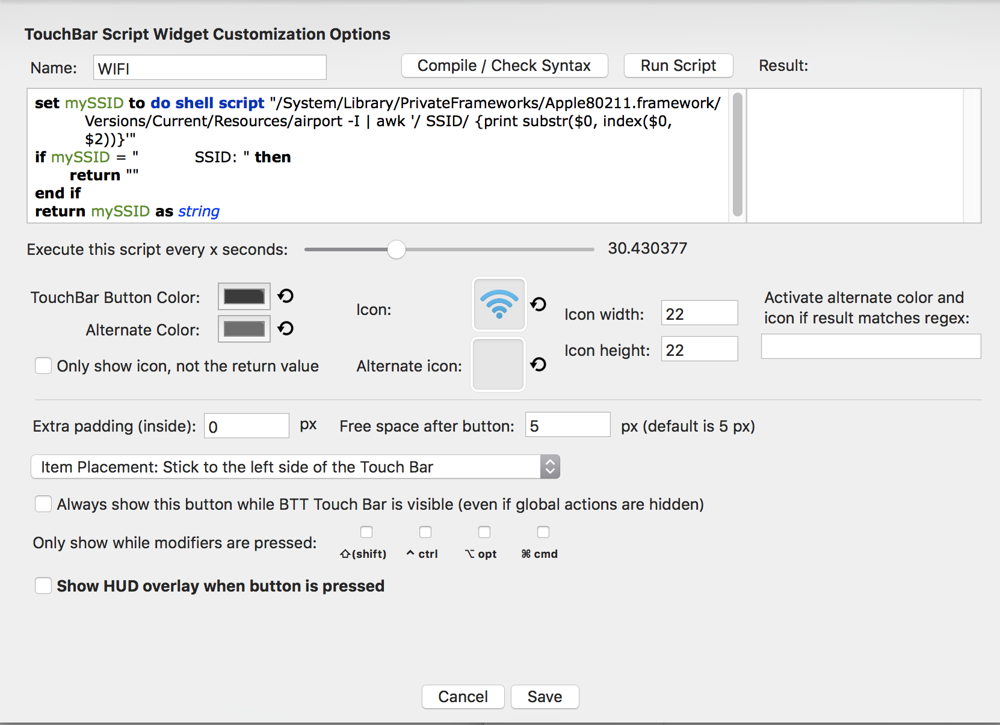

# BetterTouchTool - Wifi - Touch Bar

## Description

If you have a MacBook Pro with the touchbar this project will help you to customize your touchbar by :
 - Displaying the current connected wifi network

Example Full bar (1st widget) :

Example widget :

## Prerequisite

 - MacBook pro with the Touch Bar
 - You can read this article: [Hands-on: Creating a custom Touch Bar button using BetterTouchTool](https://9to5mac.com/2016/12/02/hands-on-custom-touch-bar-button-bettertouchtool-video/)
 - [BetterTouchTool](https://www.boastr.net/downloads/)

## Config

First, you need to add a new widget on the global section. Find the configuration below.

#### Icon

#### Script

For the widget display paste the following script as shared on the previous screenshot:

[touchbar.applescript](./touchbar.applescript)

And Voila !

### Other widget available on github

- [Spotify](https://github.com/olivierodo/MBP-BTT-spotify-touchbar)
- [Clipboard](https://github.com/olivierodo/MBP-BTT-clipboard-touchbar)
